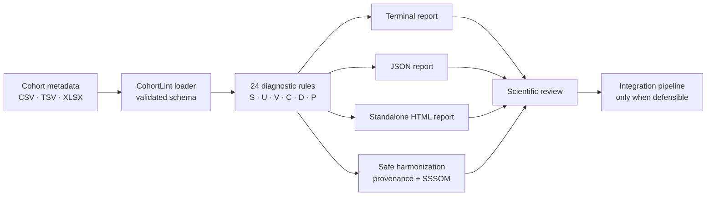

<div align="center">

# 🧬 CohortLint

### Pre-integration metadata diagnostics for multi-cohort omics studies

**Find broken study designs, incompatible metadata, and privacy risks before they reach your integration pipeline.**

[](https://pypi.org/project/cohortlint/)
[](https://pypi.org/project/cohortlint/)
[](https://github.com/Aristotheles/CohortLint/actions/workflows/ci.yml)
[](LICENSE)
[](https://github.com/Aristotheles/CohortLint/releases/latest)

[English](#english) · [Türkçe](#türkçe) · [Windows download](https://github.com/Aristotheles/CohortLint/releases/download/v0.1.0/CohortLint-0.1.0-Windows-x64-portable.zip) · [Rule catalogue](docs/rules.md)

</div>

---

# English

## Why CohortLint?

When multiple cohorts are pooled for a joint omics analysis, expression matrices usually
receive careful quality control while sample metadata does not. Unit mismatches,
inconsistent encodings, missing covariates, residual identifiers, and—most critically—study
designs where the biological effect cannot be separated from batch are often discovered
only after integration has already been run.

CohortLint is the quality gate immediately **before integration**. It reads metadata tables,
evaluates whether cohorts can be combined safely, and clearly separates:

- issues that can be fixed automatically;
- issues that require a scientific decision;
- design failures that no downstream batch-correction method can repair.

> CohortLint never reads expression matrices and never performs batch correction. It helps
> you decide whether integration is defensible before expensive downstream analysis begins.

## Highlights

- **24 diagnostic rules** covering structure, units, vocabulary, completeness, study design,
  and privacy hygiene.
- **Critical confounding detection** for batch–condition association, complete confounding,
  rank deficiency, multicollinearity, and group-size imbalance.
- **Three languages:** English, German, and Turkish.
- **Three report formats:** readable terminal output, machine-readable JSON, and standalone
  HTML with an integrability score and contingency tables.
- **Conservative harmonization:** only declared categorical synonyms, decimal separators,
  and accepted ontology mappings are rewritten.
- **Ontology support:** optional `text2term` integration with a bounded offline cache and
  SSSOM mapping export.
- **Privacy-aware evidence:** direct identifier findings report counts, never matched values.
- **Portable Windows package:** a self-contained executable with a double-click demonstration.
- **Cross-platform CI:** Python 3.11–3.13 on Linux, macOS, and Windows.

## How it fits into an omics workflow



## Rule families

| Family | Purpose | Examples |
|---|---|---|
| **S — Structural** | Validate table shape and identifiers | duplicate sample IDs, schema drift, type disagreement |
| **U — Units & encodings** | Detect incompatible representations | years vs months, decimal commas, scale mismatch, invalid ranges |
| **V — Vocabulary** | Review ontology mappings | unmapped terms, low-confidence mappings, near-duplicate labels |
| **C — Completeness** | Measure missing data risk | absent required covariates, high or differential missingness |
| **D — Study design** | Test whether the intended analysis is estimable | batch association, complete confounding, rank deficiency, VIF |
| **P — Privacy hygiene** | Find GDPR-relevant metadata risks | residual identifiers, small quasi-identifier groups, precise dates |

The generated [rule catalogue](docs/rules.md) lists every rule, its default severity, and its
localized title.

## Installation

### PyPI

```bash
pip install cohortlint
```

Optional ontology mapping:

```bash
pip install "cohortlint[ontology]"
```

Optional AnnData support:

```bash
pip install "cohortlint[anndata]"
```

### Portable Windows package

No Python setup is required for the portable package:

1. Download [CohortLint 0.1.0 for Windows x64](https://github.com/Aristotheles/CohortLint/releases/download/v0.1.0/CohortLint-0.1.0-Windows-x64-portable.zip).
2. Extract the ZIP completely.
3. Double-click `Test-Et.cmd` to analyze the included example and open an HTML report.
4. Use `CohortLint.exe` from PowerShell or Command Prompt for your own metadata.

The executable is currently unsigned, so Microsoft SmartScreen may show an unknown-publisher
warning. The release contains a SHA-256 checksum file for integrity verification.

## Quick start

Create a starter configuration:

```bash
cohortlint init --output cohortlint.yaml
```

Define your cohorts, target schema, biological effect, and technical variables:

```yaml
version: 1

cohorts:
  - name: berlin
    path: data/berlin.csv
    sample_id: patient_id
  - name: hannover
    path: data/hannover.xlsx
    sample_id: SampleID
    sheet: metadata

schema:
  age:
    type: numeric
    unit: years
    range: [0, 120]
    required: true
  sex:
    type: categorical
    allowed: [male, female, other, unknown]
    synonyms:
      male: [m, M, 1, männlich, erkek]
      female: [f, F, 2, weiblich, kadın]
    required: true
  condition:
    type: categorical
    role: biological
    required: true
  batch:
    type: categorical
    role: technical
    required: true

privacy:
  k_anonymity_threshold: 5

output:
  lang: en
```

Run diagnostics:

```bash
cohortlint check --config cohortlint.yaml
```

Create a standalone HTML report without failing the shell on findings:

```bash
cohortlint check \
  --config cohortlint.yaml \
  --format html \
  --output report.html \
  --fail-on never
```

Create a JSON report for automation:

```bash
cohortlint check \
  --config cohortlint.yaml \
  --format json \
  --output report.json
```

Apply only safe, declared metadata transformations:

```bash
cohortlint harmonize \
  --config cohortlint.yaml \
  --output merged.csv \
  --mappings mappings.sssom.tsv
```

Preview transformations without writing output:

```bash
cohortlint harmonize --config cohortlint.yaml --dry-run
```

## CLI reference

```text
cohortlint init [--output cohortlint.yaml]
cohortlint check [PATHS...] [--config FILE] [--lang {en,de,tr}]
                 [--format {terminal,html,json}] [--output FILE]
                 [--fail-on {error,warning,never}] [--disable RULE_ID]...
cohortlint harmonize [PATHS...] [--config FILE] [--output merged.csv]
                     [--mappings mappings.sssom.tsv] [--dry-run]
cohortlint rules [--lang {en,de,tr}]
```

Exit codes:

| Code | Meaning |
|---:|---|
| `0` | Clean, below the selected failure threshold, or `--fail-on never` |
| `1` | Findings reached the selected failure threshold |
| `2` | Invalid configuration, unreadable input, or unsafe output target |

## Understanding design findings

The **D rules are the scientific core of CohortLint**. In particular, D002 detects complete
or level-specific confounding between the biological variable and technical batches. If
condition and batch cannot be separated in the observed design, no downstream correction
method can reconstruct the missing comparison. CohortLint reports this directly instead of
pretending metadata rewriting can repair the design.

The 0–100 integrability score is a communication heuristic, not a statistic or a guarantee.
Always inspect the underlying findings, evidence, and contingency tables.

## Safe harmonization boundary

`harmonize` may apply only:

- U002 declared categorical synonym normalization;
- U003 decimal-comma conversion for numeric fields;
- V003 accepted high-confidence ontology mappings.

Every change is written to a provenance sidecar. Design findings are never rewritten or
silently “fixed.”

## Security and privacy

- YAML is parsed with `safe_load`.
- HTML uses Jinja autoescaping and a restrictive Content Security Policy.
- P001 evidence contains counts, never matched direct-identifier values.
- Report and harmonization outputs cannot overwrite input metadata or configuration files.
- Ontology cache names are sanitized, cache size is bounded, and symlink overwrites are
  rejected.
- CI runs Bandit and `pip-audit`; GitHub Actions are pinned to immutable commit SHAs.
- PyPI releases use OIDC Trusted Publishing instead of a stored API token.

Privacy findings are heuristics and **do not constitute a GDPR or regulatory compliance
assessment**. See [SECURITY.md](SECURITY.md) for the threat model and vulnerability reporting
process.

## Public-data demonstration

The executable notebook [public_multicohort_demo.ipynb](notebooks/public_multicohort_demo.ipynb)
downloads public NCBI GEO metadata from GSE171524, aggregates it to donor level, creates two
deterministic demonstration cohorts, and generates an HTML report. Expression matrices are
not downloaded or processed.

For a complete metadata-to-expression example, the reproducible
[GSE171524 public transcriptomics case study](case_studies/gse171524/README.md) uses a
computationally bounded subset of the same public single-nucleus RNA-seq study. It runs
CohortLint first, then produces donor-level pseudobulk QC, cell-composition summaries, PCA,
an explicitly exploratory expression comparison, and a self-contained HTML overview. The
case study keeps expression analysis outside CohortLint's package contract and documents its
statistical limitations to avoid overstating the results.

## Development

```bash
git clone https://github.com/Aristotheles/CohortLint.git
cd CohortLint
python -m pip install -e ".[dev]"

ruff check .
mypy
pytest --cov=cohortlint
bandit -q -r src
pip-audit . --skip-editable
```

The test suite includes golden statistical values and property-based invariants. Current
coverage exceeds 85% overall and 95% for the critical design-rule module.

## Contributing

Issues, reproducible bug reports, documentation improvements, translations, and carefully
reviewed pull requests are welcome. Please do not include patient metadata, credentials,
direct identifiers, or other sensitive information in issues or test fixtures.

## Support the open-source mission

CohortLint is free, ad-free, and open source. If it saves research time or helps prevent an
invalid analysis, you can support continued development:

<p>
  <a href="https://patreon.com/opensource2"></a>
  <a href="https://github.com/Aristotheles"></a>
</p>

- **Patreon:** [patreon.com/opensource2](https://patreon.com/opensource2)
- **Bitcoin (BTC, BlueWallet):** `bc1q7kpfdc9stpnexvwgpzxl8nzaua8wfyp2ht8xxa`
- **YouTube:** [Breath of Rumi](https://www.youtube.com/@BreathofRumi) · [Kalpten Nağme](https://www.youtube.com/@KalptenNa%C4%9Fme)

Support funds open-source development sessions and helps the developer's daughter continue
her international higher education in engineering and architecture.

## License

CohortLint is released under the [MIT License](LICENSE). Runtime dependency licences are
recorded in [docs/dependencies.md](docs/dependencies.md).

---

# Türkçe

## CohortLint neden gerekli?

Birden fazla kohort ortak bir omik analiz için birleştirilirken ifade matrisleri genellikle
ayrıntılı kalite kontrolden geçirilir; örnek metadata tabloları ise aynı dikkati görmez. Birim
uyuşmazlıkları, farklı kategorik kodlamalar, eksik kovaryatlar, metadata içinde kalmış doğrudan
tanımlayıcılar ve en önemlisi biyolojik etkinin batch etkisinden ayrılamadığı çalışma tasarımları
çoğu zaman entegrasyon tamamlandıktan sonra fark edilir.

CohortLint, entegrasyondan **hemen önce** çalışan kalite kapısıdır. Metadata tablolarını okur,
kohortların bilimsel olarak savunulabilir biçimde birleştirilip birleştirilemeyeceğini inceler ve
problemleri açıkça üç gruba ayırır:

- güvenle otomatik düzeltilebilecek sorunlar;
- bilimsel veya klinik karar gerektiren sorunlar;
- hiçbir downstream batch-düzeltme yönteminin onaramayacağı tasarım kusurları.

> CohortLint ifade matrisi okumaz ve batch düzeltmesi yapmaz. Amacı, pahalı analizlere
> başlamadan önce entegrasyon tasarımının savunulabilir olup olmadığını göstermektir.

## Öne çıkan özellikler

- Yapı, birim, sözlük, eksiksizlik, çalışma tasarımı ve gizlilik alanlarında **24 tanılama
  kuralı**.
- Batch–koşul ilişkisi, tam konfunding, rank eksikliği, multicollinearity ve küçük grup
  problemleri için kritik tasarım kontrolleri.
- İngilizce, Almanca ve Türkçe çıktı.
- Terminal, JSON ve bağımsız HTML raporları.
- Sadece güvenli ve önceden tanımlanmış dönüşümleri uygulayan kontrollü harmonizasyon.
- İsteğe bağlı `text2term` ontoloji eşlemesi, çevrimdışı cache ve SSSOM çıktısı.
- Doğrudan tanımlayıcı değerleri göstermeyen, yalnızca adet bildiren gizlilik bulguları.
- Kurulum gerektirmeyen taşınabilir Windows EXE paketi.
- Linux, macOS ve Windows üzerinde Python 3.11–3.13 CI doğrulaması.

## Kural aileleri

| Aile | Amaç | Örnekler |
|---|---|---|
| **S — Yapısal** | Tablo yapısını ve örnek kimliklerini doğrular | yinelenen örnek ID, şema kayması, veri tipi uyuşmazlığı |
| **U — Birim ve kodlama** | Uyumsuz gösterimleri yakalar | yıl/ay farkı, ondalık virgül, ölçek farkı, aralık dışı değer |
| **V — Sözlük** | Ontoloji eşlemelerini inceler | eşlenmemiş terim, düşük güven, birbirine yakın etiketler |
| **C — Eksiksizlik** | Eksik veri riskini ölçer | gerekli kovaryatın yokluğu, yüksek ve diferansiyel eksiklik |
| **D — Çalışma tasarımı** | Tasarımın tahmin edilebilirliğini sınar | batch ilişkisi, tam konfunding, rank eksikliği, VIF |
| **P — Gizlilik hijyeni** | GDPR açısından önemli metadata risklerini bulur | doğrudan tanımlayıcı, küçük quasi-identifier grubu, hassas tarih |

Tüm kuralların kimlikleri, varsayılan önem düzeyleri ve üç dildeki başlıkları
[kural kataloğunda](docs/rules.md) yer alır.

## Kurulum

### PyPI ile

```bash
pip install cohortlint
```

Ontoloji desteği için:

```bash
pip install "cohortlint[ontology]"
```

AnnData desteği için:

```bash
pip install "cohortlint[anndata]"
```

### Windows EXE paketi

Taşınabilir paket için Python kurmanız gerekmez:

1. [CohortLint 0.1.0 Windows x64 paketini indirin](https://github.com/Aristotheles/CohortLint/releases/download/v0.1.0/CohortLint-0.1.0-Windows-x64-portable.zip).
2. ZIP dosyasını tamamen çıkartın.
3. İçindeki örnek analizi çalıştırmak için `Test-Et.cmd` dosyasına çift tıklayın.
4. Kendi metadata dosyalarınız için PowerShell veya Komut İstemi üzerinden
   `CohortLint.exe` komutunu kullanın.

EXE henüz ticari kod imzalama sertifikasıyla imzalanmadığından SmartScreen bilinmeyen
yayıncı uyarısı gösterebilir. Release sayfasında bütünlük kontrolü için SHA-256 dosyası da
bulunur.

## Hızlı başlangıç

Örnek yapılandırma oluşturun:

```bash
cohortlint init --output cohortlint.yaml
```

`cohortlint.yaml` içinde kohortları, örnek kimliği sütununu, hedef şemayı, biyolojik değişkeni
ve teknik batch değişkenlerini tanımlayın. Ardından kontrolü başlatın:

```bash
cohortlint check --config cohortlint.yaml --lang tr
```

HTML raporu oluşturun:

```bash
cohortlint check \
  --config cohortlint.yaml \
  --lang tr \
  --format html \
  --output rapor.html \
  --fail-on never
```

Otomasyon sistemleri için JSON raporu alın:

```bash
cohortlint check \
  --config cohortlint.yaml \
  --format json \
  --output rapor.json
```

Yalnızca güvenli dönüşümleri uygulayın:

```bash
cohortlint harmonize \
  --config cohortlint.yaml \
  --output birlestirilmis.csv \
  --mappings mappings.sssom.tsv
```

Dosyaya yazmadan önce dönüşümleri görmek için:

```bash
cohortlint harmonize --config cohortlint.yaml --dry-run
```

## Bulgular nasıl yorumlanmalı?

- **ERROR:** Entegrasyonun geçerliliğini bozabilecek veya yürütmeyi engelleyen sorun.
- **WARNING:** Entegrasyon mümkün olsa bile sonuç kalitesini, gücü veya yorumlanabilirliği
  azaltabilecek sorun.
- **INFO:** Karar verirken bilinmesi gereken gözlem; tek başına işlem zorunluluğu doğurmaz.

D kategorisi CohortLint’in bilimsel merkezidir. Özellikle D002, biyolojik koşulla teknik batch
arasında tam veya belirli bir düzeye özgü konfunding olup olmadığını inceler. Gözlenen tasarımda
iki değişken birbirinden ayrılamıyorsa downstream düzeltme yöntemleri eksik karşılaştırmayı
yeniden oluşturamaz. CohortLint bu durumu metadata üzerinde yapay bir değişiklikle gizlemez.

0–100 entegrasyon skoru bir iletişim sezgisidir; istatistiksel garanti değildir. Her zaman
bulguların kanıtlarını ve contingency tablolarını inceleyin.

## Güvenli harmonizasyon sınırı

`harmonize` yalnızca şu dönüşümleri uygulayabilir:

- U002 kapsamında tanımlanmış kategorik eş anlamlıların normalizasyonu;
- U003 kapsamında sayısal alanlardaki ondalık virgülün dönüştürülmesi;
- V003 kapsamında kabul edilmiş yüksek güvenli ontoloji eşlemeleri.

Her dönüşüm provenance yan dosyasına kaydedilir. Çalışma tasarımı problemleri hiçbir zaman
metadata yeniden yazılarak “düzeltilmez.”

## Güvenlik ve gizlilik

- YAML dosyaları `safe_load` ile okunur.
- HTML raporlarında Jinja autoescape ve kısıtlayıcı Content Security Policy kullanılır.
- P001 eşleşen doğrudan tanımlayıcıları değil, yalnızca sütun ve adet bilgisini raporlar.
- Rapor ve harmonizasyon çıktılarının giriş dosyalarının üzerine yazmasına izin verilmez.
- Ontoloji cache adları temizlenir, cache boyutu sınırlandırılır ve symlink üzerine yazma
  reddedilir.
- CI içinde Bandit ve `pip-audit` çalışır; GitHub Actions sürümleri değiştirilemez commit
  SHA’larına sabitlenmiştir.
- PyPI yayını saklanan API anahtarı yerine OIDC Trusted Publishing kullanır.

Gizlilik bulguları sezgiseldir ve **GDPR ya da başka bir mevzuat için uyumluluk değerlendirmesi
değildir**. Ayrıntılar için [SECURITY.md](SECURITY.md) dosyasına bakın.

## Gerçek veri vaka çalışması

[GSE171524 transkriptomik vaka çalışması](case_studies/gse171524/README.md), herkese açık
insan akciğeri tek çekirdek RNA-seq verisi üzerinde baştan sona tekrar üretilebilir bir örnek
sunar. Akış önce CohortLint ile metadata kalite kapısını çalıştırır; ardından 13 donör için
pseudobulk kalite kontrolü, hücre tipi bileşimi, PCA, açıkça keşifsel olarak etiketlenmiş ifade
karşılaştırması ve bağımsız bir HTML özet üretir.

Bu analiz CohortLint paketinin ifade matrisi okumadığı sınırını değiştirmez. Downstream analiz
ayrı bir vaka çalışmasıdır; klinik sonuç ya da özgün makalenin yeniden üretimi değildir ve
istatistiksel sınırlamaları açıkça belgelenmiştir.

## Katkıda bulunma

Hata bildirimleri, tekrar üretilebilir test vakaları, çeviriler, dokümantasyon geliştirmeleri ve
dikkatle hazırlanmış pull request’ler memnuniyetle karşılanır. Issue veya test fixture içine
gerçek hasta metadata’sı, doğrudan tanımlayıcı, API anahtarı ya da parola eklemeyin.

## Açık kaynak çalışmalarını destekleyin

CohortLint ücretsiz, reklamsız ve açık kaynaklıdır. Araştırma sürecinizde zaman kazandırdıysa
veya geçersiz bir analizi önlemenize yardımcı olduysa geliştirme çalışmalarının devamını
destekleyebilirsiniz:

<p>
  <a href="https://patreon.com/opensource2"></a>
  <a href="https://github.com/Aristotheles"></a>
</p>

- **Patreon:** [patreon.com/opensource2](https://patreon.com/opensource2)
- **Bitcoin (BTC, BlueWallet):** `bc1q7kpfdc9stpnexvwgpzxl8nzaua8wfyp2ht8xxa`
- **YouTube:** [Breath of Rumi](https://www.youtube.com/@BreathofRumi) · [Kalpten Nağme](https://www.youtube.com/@KalptenNa%C4%9Fme)

Destekler açık kaynak geliştirme çalışmalarına ve geliştiricinin kızının mühendislik ve mimarlık
alanındaki uluslararası yükseköğrenimine devam etmesine katkı sağlar.

## Lisans

CohortLint [MIT Lisansı](LICENSE) ile yayımlanır. Çalışma zamanı bağımlılıklarının lisansları
[docs/dependencies.md](docs/dependencies.md) dosyasında kayıtlıdır.

---

<div align="center">

**Build defensible integrations—not just successful pipelines.**

**Sadece çalışan değil, bilimsel olarak savunulabilir entegrasyonlar kurun.**

</div>
